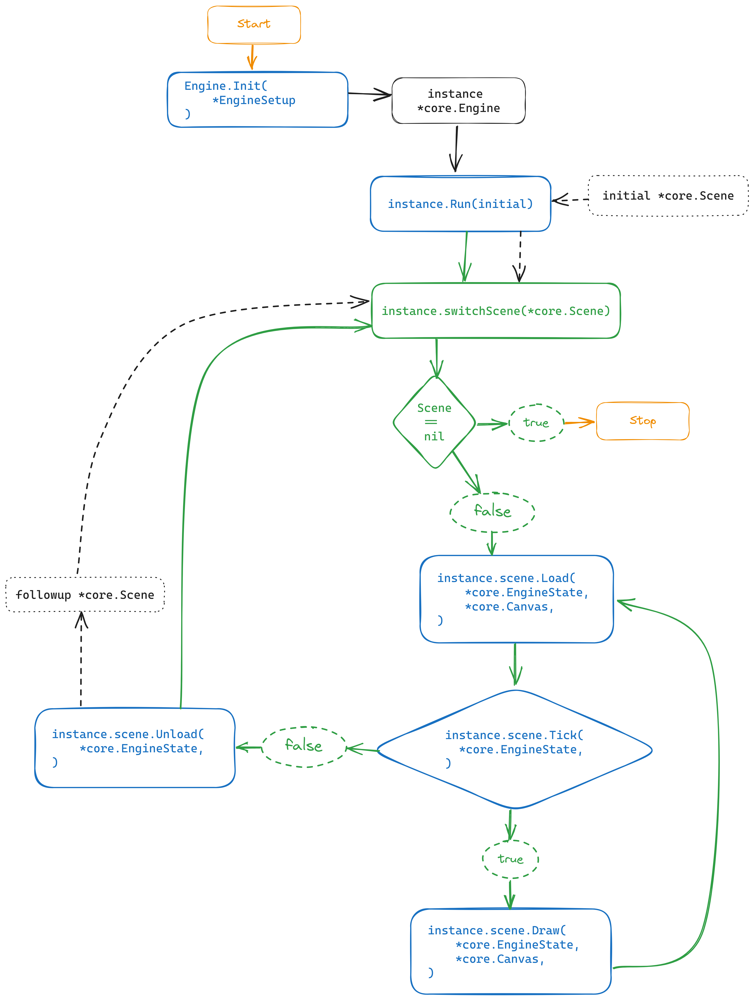

# The Engine-Lifecycle



The Engines Lifecycle may look complicated at first but you will only interact
at a few points with it. (All the Blue-Methods in the graphic above)

To make things easier to understand, I'll use Vehicle (like a Car or Bike) as an
analogy.

## 1.) Initialization (Building the Frame)

```
GoWas.Init(GoWas.EngineSetup)
```

Before we can drive something, we must first define what we want to drive. In a
sence we are defining the Frame of our Vehicle. You define the Size of your
Viewport here. The Viewport could be seen as the Windshield of a car. Letting
the driver see what is happening.

This is done via:

```go
import "github.com/rocco-gossmann/GoWas"

func main() {
    var engine := GoWas.Init(GoWas.EngineSetup{
        //WindowWidth uint16,
        //WindowHeight uint16,
    })
}
```

For more Details on how to initialize the GoWas-Engine, please read the
[Engine-Reference](./Engine.md)

## 2.) Initial-Scene-Setup (Defining your Vehicle)

Now that we have a Frame, we need to define, what our Vehicle will be filled
with. What levers or wheels are on it.

This is where the `core.Scene` comes in.

The GoWas Core defines 4 Interfaces.

```go
type Loadable interface {
    Load(e *EngineState, ec *Canvas)
}
```

```go
type Drawable interface {
    Draw(e *EngineState, ec *Canvas)
}
```

```go
type Tickable interface {
    Tick(e *EngineState) bool
}
```

```go
type Unloadable interface {
    Unload(e *EngineState) *struct{}
}
```

> [!attention]\
> Any struc{} that implements the `Drawable` and/or `Tickable` interface Will be
> a valid `core.Scene`
>
> You don't have to implemet all 4 interfaces, if you don't need them.

### 2a.) Loading the Scene (Getting into the Vehicle and turning the ignition key)

A scenes `Load(*core.EngineState, *core.Canvas)` method is called before the
Engine starts running its main-loop.

Here is, where you should initilize your ressources, that the Engine will use
when it is running.

You can also uses to define the initial State of the Viewport.

In our analogy, this this is the point, where you fill the Cockpit or driver
cabin of your Vehicle.\
Do you want to steer it with a Wheel, a Bike-Handle or a Game-Controller.

### 2b.) Ticking (Defining what happens with each Stroke of the Engine)

The Cockpit is setup, you turned the Key, now the Engine is running and each tick / stroke.
your Scenes `Tick(*core.EngineState) bool` - Method is called.

In here, you can do what ever you want with the Ressources you set up in your Scenes `Load(...)`-Method.

The `Tick(...)` method must however return a `boolean` to tell the engine,
if it should keep running like this.


### 2c.) Drawing (Showing the driver what is going on)

After each Tick, your Scenes `Draw(*core.EngineState, *core.Canvas)` Method is called.
`*core.Canvas` is our viewport, that can be manipulated in this step.

It is more likely however, that you will just pass it through to some components, you 
set up in your scenes `Load(...)` Method.

> [!notice]  
> Drawing and Ticking are separated.
> once your scenes `Tick(...)` method returns `false` the call to `Draw(...)` is skipped. 

//TODO: Continue here:


