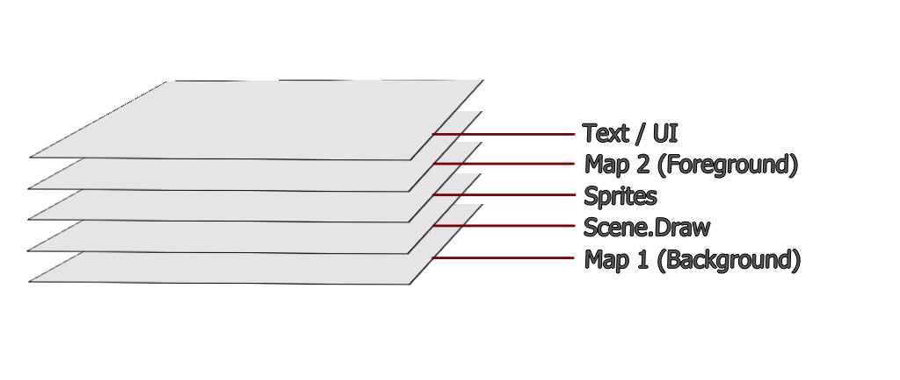

# Graphics and Sound
<!-- TOC -->

- [Graphics and Sound](#graphics-and-sound)
    - [Structure](#structure)
        - [Assets](#assets)
        - [Components](#components)
    - [Display Layers](#display-layers)
        - [Layer Descriptions](#layer-descriptions)
        - [Rearranging Layers](#rearranging-layers)
    - [Components](#components)
    - [Assets](#assets)
        - [Adding Assets at compile-time](#adding-assets-at-compile-time)
            - [Using PNG Files](#using-png-files)
            - [Filename-Conversion](#filename-conversion)

<!-- /TOC -->

## Structure

When it comes to Graphics and Sound, they are split into [`Assets`](#assets) and [`Components`](#components) 

### [`Assets`](#assets) 
being related to the actual binary data.  
These would mean things like 
- *.PNG files
- *.BIN files
- *.MP3 files
- [`Bitmaps`](./reference/Bitmap.md)

### [`Components`](#components) 
meaning the Elements, that are displayed on the screen.
- [`Bitmap-Entities`](./reference/BitmapEntity.md)
- [`UI-Elements`](./reference/UI.md)
- [`Sprites`](./reference/Sprite.md)
- [`TileMaps`](./reference/TileMaps.md)
- [`TileSets`](./reference/TileSets.md)


## Display Layers

Graphics are displayed via a Layer-System.  
Everything that is drawn, will be on one of these layers.
The default formation looks like this. (The Top layer is drawn last.)




> [!important]   
> Right now only the `Text / UI` and `Scene.Draw` layers are implemented.

### Layer Descriptions

Each layer comes with: 
- a Go `core.`Name, that is used for [Rearranging Layers](#rearranging-layers)

and with Exception of the `Scene.Draw` Layer each Layer also has

- a Direct-Access property in the [`core.EngineState`](./reference/EngineState.md) (provided via [`core.Scene` Lifecycle-Hooks](./Scenes.md))   
- and enable and disable functions inside the [`core.EngineState`](./reference/EngineState.md)


| Layer | Description | Direct-Access | Go<br>`core.` Name | EngineState<br>En- /Disable |
| - | - | - | - | - |
| Text / UI | meant to display Text and [`ui` - elements](./reference/UI.md)  | `engineState.Text` | `CANV_RL_TEXT` | see [EngineState](./reference/EngineState.md#layer-control) | 
| Map 2 |   | `engineState.Map2` | `CANV_RL_MAP2` |  see [EngineState](./reference/EngineState.md#layer-control) | 
| Sprites |   | `engineState.Sprites` | `CANV_RL_SPRITES` |  see [EngineState](./reference/EngineState.md#layer-control) |
| Scene.Draw |  Displays everything rendered by the core.Scene    | [Scene.Draw-Lifecyclehook](./Scenes.md#drawable) | `CANV_RL_SCENE` | En-/Disables automatically if the Scene has the Lifecycle-hook | |
| Map 1 |   | `engineState.Map1` | `CANV_RL_MAP1` |   see [EngineState](./reference/EngineState.md#layer-control) |


### Rearranging Layers


## Components

//TODO: 


## Assets


### Adding Assets at compile-time 

Assets added at Compile-Time are available right from the Start of the Application, they don't need to be requested separatly by the browser and thus load quicker. 

Their binary data is baked into the Executable / WASM file.

In return, they increase the size of of your executable, which can lead to a slower start, depending on the the size and complexety of the included Ressource.


#### Using PNG Files

For now It is only possible to load PNG-Files.\
At the moment, these are converted into `*.go` files and become part of the WASM
binary.

The Conversion process is handled by the `Makefile` as long, as you follow the
following steps.

> [!warning] 
> To follow this process, you need to have finished the [Setup](./Setup.md) first.

1. Put any PNG, you wish to become part of the Project into the `./assets` -
   Folder in your Project

2. run the `make` command

`make` should now pick up any new or changed PNG-File and create a
`./bmps/bmp.[PNGFileName].go` File.

3. You can then access the PNG via the following way

```go
import (
    "github.com/rocco-gossmann/GoWas/core"
    "GoWasProject/bmps"
)

var myPNG *core.Bitmap = bmps.BMPPngFileName
```

The Bitmap is available via a `*core.Bitmap` pointer.

#### Filename-Conversion

The PNGs Filename is converted into a VariableName, but due to the nature of
variable names, not all characters of a filename can be put into a
variable name, theirefore all characters, that don't match the following regexp
are stripped from the file name `[A-Za-z0-9_]`

Here are a few examples of file- to variable name conversions

| Asset-File                       | Go-File                       | Go-Variable          |
|----------------------------------|-------------------------------|----------------------|
| `./assets/cursor.png`            | `./bmps/bmp.cursor.go`        | `BMPcursor`          |
| `./assets/map 1.png`             | `./bmps/bmp.map 1.go`         | `BMPmap1`            |
| `./assets/1-SpriteSheet.new.png` | `./bmps/1-SpriteSheet.new.go` | `BMP1SpriteSheetnew` |


> [!todo] 
> Implement Sound
