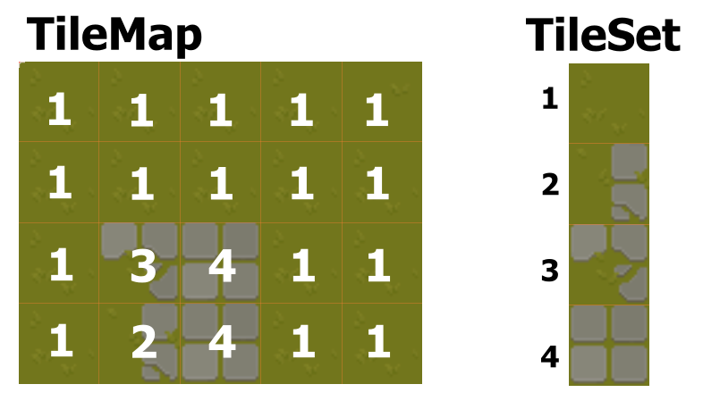
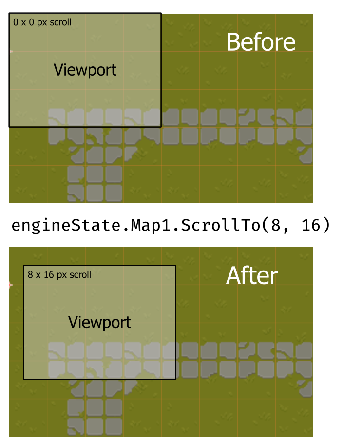
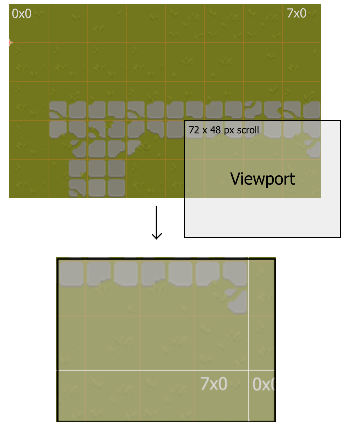

# Tile Maps
 
Tilemaps are a 2-dimensional grid of bytes, where each entry points to an Entry of a [TileSet](./TileSets.md)




<!-- TOC depthfrom:1 depthto:2 -->

- [Tile Maps](#tile-maps)
- [Build in Map Layers](#build-in-map-layers)
- [Available Methods](#available-methods)
    - [Init](#init)
    - [SetMap](#setmap)
    - [SetTileSet](#settileset)
    - [Clear](#clear)
    - [SetTile](#settile)
    - [AlphaSet](#alphaset)
    - [AlphaReset](#alphareset)
    - [Alpha](#alpha)
    - [ScrollTo](#scrollto)
- [Creating your own TileMaps](#creating-your-own-tilemaps)

<!-- /TOC -->

# Build in Map Layers

In the [ Display Layers](../Graphics_and_Sound.md#display-layers), You get access to two TileMaps out of the Box.

The Maps default Size is 32x32 tiles.
You probably want to adjust that, depending on your chosen resolution and the size 
of the [TileSet](./TileSets.md) you plan to use. 
(See [Engine-Setup](./Engine.md#enginesetup) for more info on how to change the Maps size)

Before you can enable any of the two Build in Maps, you must first define a [TileSet](./TileSets.md), that your chosen layer will use

The following would need to happen during your Scenen [Load-Lifecycle-Hook](../Scenes.md#loadable)

```go
func (me *ExampleScene) Load(state *core.EngineState, canvas *core.Canvas) {
    var tileSet := core.TileSet{}
    tileSet.InitFromMapSheet( 
        /* your core.Bitmap */, 
        /* PixelWidth of each Tile */,
        /* PixelHeight of each Tile */,
    );
    // ...
```

with That, you can then enable your chosen Map-Layer through the [Engine State](./EngineState.md#display-layer-control)
```go
    // ... 
    state.EnableMap1Layer(&tileSet)
    // ...
```
And Start filling it with Data
```go
    //...
    state.Map1.SetMap([]byte{ /* your Maps Tile definitions goes here */ })
}
```


# Available Methods

## Init
```go 
func (tm *TileMap) Init(tileSet *core.TileSet, width, height uint32) *TileMap 
```
> [!warning]
> using this method on the [Build In Maps](#build-in-map-layers), will cause GO to panic.


If you don't use the [Build In Maps](#build-in-map-layers), you MUST initialize your Maps first.
see [Creating your own TileMaps](#creating-your-own-tilemaps) for more details.

### Parameters

| Parameter | Type                             | Description                                                                                                |
|-----------|----------------------------------|------------------------------------------------------------------------------------------------------------|
| `ts`      | [`*core.TileSet`](./TileSets.md) | The catalogue from which the map will define, how to draw each tile.<br> Must not have more than 255 Tiles |
| `width`   | uint32                           | Numer of tiles on the x axis                                                                               |
| `height`  | uint32                           | Numer of tiles on the y axis                                                                               |

### Returns
`*core.TileMap`
The Tilemap, on which that Method was executed.  
(That way, you can chain multiple Setter Functions together)


## SetMap
```go 
func (*TileMap) SetMap (tiles []byte) *TileMap
```
Redefines all Tiles in the Map


### Parameters
| Parameter | Type     | Description                                        |
|-----------|----------|----------------------------------------------------|
| `tiles`   | `[]byte` | A slice of bytes containing the new Map definition |

Tiles are updated from left to right first and top to bottom second.
So in a 6x3 Tilemap, the Bytes would be assigned as follows 

```text
------------------------------------------------------------------------------------
|  tiles[0]   |  tiles[1]   |  tiles[2]   | tiles[3]   |  tiles[4]   |  tiles[5]   |
------------------------------------------------------------------------------------
|  tiles[6]   |  tiles[7]   |  tiles[8]   | tiles[9]   |  tiles[10]  |  tiles[11]  |
------------------------------------------------------------------------------------
|  tiles[12]  |  tiles[13]  |  tiles[14]  | tiles[15]  |  tiles[16]  |  tiles[17]  |
------------------------------------------------------------------------------------
```

> [!warning]
> How many Bytes the given Slice must contain depends either on `width` * `height` given during the Maps [Init](#init) call
> or, if you use the [Build In Maps](#build-in-map-layers) the `TileMapWith` * `TileMapHeight` given during the [Engine Setup](../reference/Engine.md#enginesetup)

### Returns
`*core.TileMap`
The Tilemap, on which that Method was executed
(That way, you can chain multiple Setter Functions together)


## SetTileSet
```go
func (me *TileMap) SetTileSet(ts *TileSet) *TileMap
```
Allows for changing the Maps TileSet after the Map was [Initialized](#init).

> [!note]   
> If a Tiles Tile-Pixel-Size changes the overall displayed pixel-Size of the map will change with it

### Parameters
| Parameter | Type                             | Description                                                                                                |
|-----------|----------------------------------|------------------------------------------------------------------------------------------------------------|
| `ts`      | [`*core.TileSet`](./TileSets.md) | The catalogue from which the map will define, how to draw each tile.<br> Must not have more than 255 Tiles |

### Returns
`*core.TileMap`
The Tilemap, on which that Method was executed
(That way, you can chain multiple Setter Functions together)

## Clear
```go
func (me *TileMap) Clear(tileIndex byte) *TileMap 
```
Resets all Tiles in the Map back to 0

### Returns
`*core.TileMap`
The Tilemap, on which that Method was executed
(That way, you can chain multiple Setter Functions together)


## SetTile 
```go
func (me *TileMap) SetTile(x, y uint32, tile byte) *TileMap
```
Changes what Tile is displayed at coordinates x, y

### Parameters
| Parameter | Type     | Description                                             |
|-----------|----------|---------------------------------------------------------|
| `x`       | `uint32` | The Tiles X coordinate in the Map                       |
| `y`       | `uint32` | The Tiles Y coordinate in the Map                       |
| `tile`    | `byte`   | The new Tiles index inside the [TileSet](./TileSets.md) |

### Returns
`*core.TileMap`
The Tilemap, on which that Method was executed
(That way, you can chain multiple Setter Functions together)


## AlphaSet 
```go
func (me *TileMap) AlphaSet(a CanvasAlpha) *TileMap {
```
### Parameters
(see: [Alpha-Blending => AlphaSet](./AlphaBlending.md#alphaset))

### Returns
`*core.TileMap`
The Tilemap, on which that Method was executed
(That way, you can chain multiple Setter Functions together)

## AlphaReset 
```go
func (me *TileMap) AlphaReset() *TileMap {
```
### Parameters
(see: [Alpha-Blending => AlphaReset](./AlphaBlending.md#alphareset))

### Returns
`*core.TileMap`
The Tilemap, on which that Method was executed
(That way, you can chain multiple Setter Functions together)

## Alpha
```go
func (me *TileMap) Alpha() CanvasAlpha
```
### Returns
[`CanvasAlpha`](./AlphaBlending.md#canvasalpha)
the current Alpha-Level of the Map


## ScrollTo
```go
func (me *TileMap) ScrollTo(x, y int32) *TileMap
```

Offsets the visible area of the map by `x` and `y` pixels.



### Parameters
| Parameter | Type    | Description                                                  |
|-----------|---------|--------------------------------------------------------------|
| `x`       | `int32` | Absolute horizontal offset starting from the left of the Map |
| `y`       | `int32` | Absolute vertical offset starting from the top of the map    |

> [!info]  
> Should the Viewport area reach the Map Borders, the Map will wrap around, to fill the Screen
> 

### Returns
`*core.TileMap`
The Tilemap, on which that Method was executed
(That way, you can chain multiple Setter Functions together)


# Creating your own TileMaps

If you don't want to remain bound to the 2 Layers, that GoWas comes with, you can also
define your own maps, that can be rendered on the [Scene.Draw Layer](../Graphics_and_Sound.md#display-layers)
during your Scenes [Draw-Lifecycle-hook](../Scenes.md#drawable)

To do so, you first must define where your Map will live inside your applications.

```go 
    myMap := core.TileMap{}
    //...
```
Then you must initialize it. For this, you can use The Maps [`Init`-Method](#init)
```go
    //...
    myMap.Init(*someTileset, 10, 10)
    //...
```
